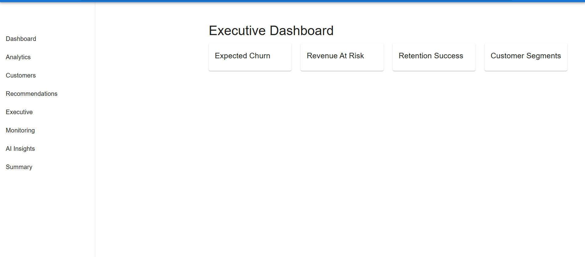
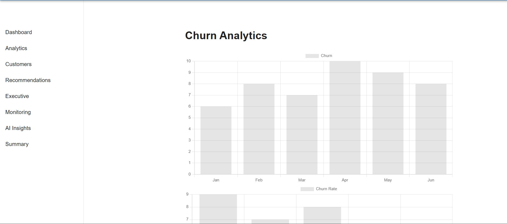
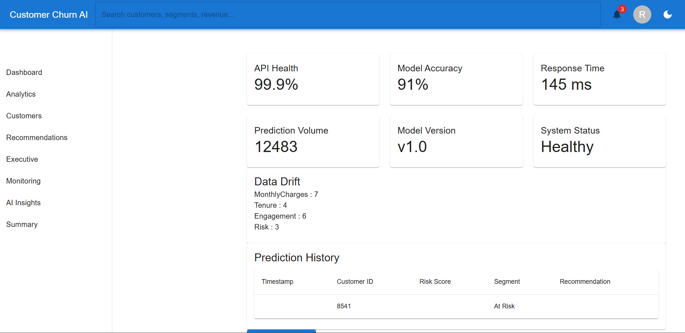

# 🚀 Customer Churn AI

> Enterprise AI-powered Customer Retention Platform that combines Predictive Analytics, Explainable AI, Monitoring, and MLOps to proactively reduce customer churn and protect business revenue.


---

# 📌 Overview

Customer Churn AI is an end-to-end enterprise customer retention platform designed to help businesses proactively identify at-risk customers, quantify revenue impact, and generate actionable retention strategies.

The platform combines machine learning, explainable AI, business intelligence dashboards, and MLOps automation into a single integrated system.

Instead of simply predicting customer churn, the system enables organizations to:

- Predict customer churn
- Forecast revenue at risk
- Segment customers
- Generate retention recommendations
- Monitor model health
- Detect data drift
- Retrain models automatically
- Track model versions

---

# 🎯 Problem Statement

Businesses lose significant revenue due to customer churn.

Traditional approaches react only after customers leave.

This platform shifts businesses from reactive retention strategies to proactive AI-driven decision making.

---

# 🏗️ System Architecture

```text
User

↓

React Enterprise Dashboard

↓

FastAPI Backend

↓

AI Engine

├── Churn Prediction

├── Revenue Forecasting

├── Customer Segmentation

├── Recommendation Engine

├── Explainable AI (SHAP)

├── Monitoring System

├── Data Drift Detection

├── Automatic Retraining

└── Model Registry

↓

PostgreSQL Database

↓

Business Insights
```

---

# ✨ Core Features

## 📊 Executive Dashboard

- Total Customers
- High Risk Customers
- Revenue At Risk
- Retention Success Rate
- Churn Trends
- Customer Segmentation
- Geographic Analysis

---

## 🤖 AI Engine

### Customer Churn Prediction

Predict customers likely to leave.

### Revenue Forecasting

Estimate future revenue impact.

### Customer Segmentation

Categorize customers into:

- High Value
- Medium Value
- Low Value

### Recommendation Engine

Generate actionable retention strategies.

Example:

```text
Customer Risk: High

Recommendation:

Offer 15% discount

Assign customer success manager

Increase engagement campaign
```

---

# 🧠 Explainable AI

Explain predictions using SHAP.

Features:

- Feature Importance
- Risk Drivers
- Customer-level explanations

---

# 📈 Enterprise Analytics Dashboard

Includes:

### KPI Cards

- Total Customers
- Revenue At Risk
- Churn Rate
- Retention Success

### Charts

- Monthly Churn Trend
- Feature Importance
- Geographic Churn Analysis
- Revenue Trends
- Customer Segmentation
- Risk Distribution

---

# 🔍 Monitoring System

AI monitoring dashboard includes:

- API Health
- Model Accuracy
- Response Time
- Prediction Volume
- Data Drift Score
- Model Version
- System Health

---

# 🔄 MLOps Pipeline

## Data Drift Detection

Detect changes in customer behavior.

```text
Training Data

↓

Incoming Data

↓

Drift Detection

↓

Alert
```

---

## Automatic Retraining

When drift is detected:

```text
Data Drift

↓

Retrain Model

↓

Evaluate

↓

Save Model

↓

Deploy
```

---

## Model Registry

Track every model version.

Stores:

- Version
- Accuracy
- Precision
- Recall
- F1 Score
- Timestamp

Example:

```text
v1

Accuracy: 91%

Date: 2026-06-24

-------------------

v2

Accuracy: 92%

Date: 2026-06-25
```

---

# 🔁 CI/CD Pipeline

GitHub Actions automatically:

```text
Code Push

↓

Backend Tests

↓

Frontend Build

↓

Validation

↓

Deployment Ready
```

---

# 🛠️ Tech Stack

## Frontend

- React
- Material UI
- Chart.js
- Axios
- React Router DOM

## Backend

- FastAPI
- Python

## Machine Learning

- Scikit-learn
- XGBoost
- CatBoost
- SHAP

## Database

- PostgreSQL

## MLOps

- Data Drift Detection
- Automatic Retraining
- Model Registry
- Monitoring

## DevOps

- Docker
- Docker Compose
- GitHub Actions

---

# 📂 Project Structure

```text
Customer-Churn-AI

frontend/

src/

components/

charts/

pages/

artifacts/

data/

reports/

tests/

mlops/

drift_detection.py

retraining.py

model_registry.py

docs/

.github/

workflows/

Dockerfile.backend

docker-compose.yml

requirements.txt

README.md
```

---

# 📸 Dashboard Screenshots

## Executive Dashboard



## Analytics Dashboard



## Monitoring Dashboard




---

# 🌐 API Endpoints

## Health Check

```http
GET /health
```

---

## Metrics

```http
GET /metrics
```

---

## Data Drift

```http
GET /data-drift
```

---

## Retrain Model

```http
POST /retrain
```

---

## Model Registry

```http
GET /model-registry
```

---

## Predict Churn

```http
POST /predict
```

---

# ⚙️ Installation

## Clone Repository

```bash
git clone https://github.com/roshaaann30/Customer-Churn-AI.git

cd Customer-Churn-AI
```

---

## Backend Setup

```bash
pip install -r requirements.txt

uvicorn src.api.app:app --reload
```

Backend:

```text
http://localhost:8000
```

Swagger:

```text
http://localhost:8000/docs
```

---

## Frontend Setup

```bash
cd frontend

npm install

npm start
```

Frontend:

```text
http://localhost:3000
```

---

## Docker Setup

```bash
docker compose up -d
```

---

# 📈 Business Impact

Potential benefits:

- 10–20% churn reduction
- 15–25% revenue protection
- Faster executive decision making
- Improved customer retention
- Better customer lifetime value

---

# 🚀 Future Enhancements

- User Authentication
- Role Based Access Control
- Real-time Notifications
- Kafka Streaming
- LLM-based AI Assistant
- Cloud Deployment
- Kubernetes Support

---

# 👨‍💻 Author

** V Roshan**

Electronics & Communication Engineering

SRM Institute of Science and Technology

Aspiring Data Scientist | AI Engineer | MLOps Enthusiast

---

⭐ If you found this project useful, give it a star.
